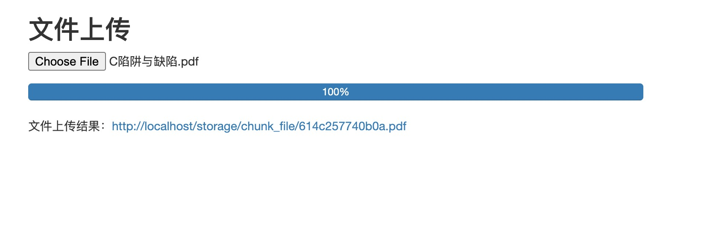
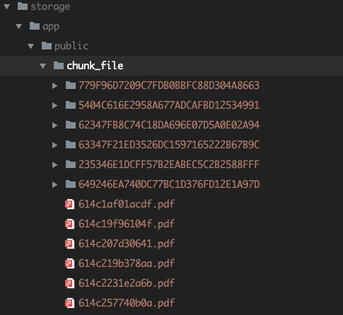

# ChunkUpload

Laravel 超大文件上传，前端对文件进行分块上传，并监听每个文件块的上传事件；后端接收所有的文件块后，进行排序与合并，输出最终目标文件。

## Composer 安装

```
composer require helingfeng/laravel-chunk-upload
```

```
php artisan vendor:publish --provider "ChunkUpload\ChunkUploadServiceProvider"
```

## 配置 OSS 存储 ACCESS_ID 与 ACCESS_KEY

打开 `config/chunk_upload.php` 配置文件，并在 `.env` 添加相应配置项
```php
// 可选 oss 或 local本地文件存储方式
'driver' => env('UPLOAD_CHUNK_DRIVER', 'local'),

// 选择 oss 是，需要补充相关配置项
// OSS ACCESS_ID
'access_id' => env('OSS_ACCESS_ID', ''),
// OSS ACCESS_KEY
'access_key' => env('OSS_ACCESS_KEY', ''),
// OSS bucket
'bucket' => env('OSS_BUCKET', ''),
...
```

## Example 示例

启动项目，并访问路径：https://yourhosts/show-upload-example



## 本地文件上传示例


